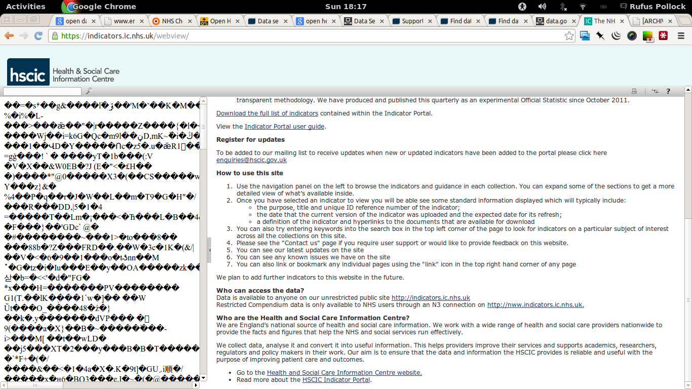
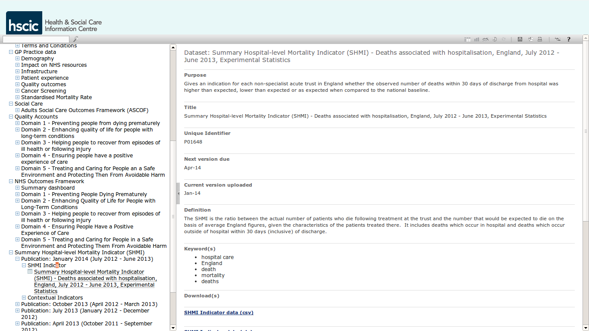

UK Health Data. Research on what's available and what you can do with it.

# What's out there

## Sources

### Health and Social Care Information Center

http://www.hscic.gov.uk/

Appear to be primary data provider of health-related open data in UK (other
than national statistics)

All of their open data is, in theory, on data.gov.uk at
http://data.gov.uk/publisher/nhs-information-centre-for-health-and-social-care
(they still have their own [search
index](http://www.hscic.gov.uk/searchcatalogue) but data.gov.uk is quite a bit
better and easier to use).

Confusingly much of the data listed in their catalog is actually to be found on
the "indicator portal": https://indicators.ic.nhs.uk/webview/

For example, the SHMI (see below) entries in the catalog at
http://www.hscic.gov.uk/searchcatalogue?productid=14111 actually have no data
(just PDFs) and link you to the indicator portal (though not to the actual
relevant dataset!)

### Care Quality Commission

http://www.cqc.org.uk/cqcdata

Only data AFAICT is CQC care directory which is just a list of care providers.

http://www.cqc.org.uk/sites/default/files/media/documents/05_mar_2014_cqc_directory.csv_.csv

## Key Indicators

### SHMI - summary hospital mortality index

SHMI == Observed Deaths / Expected Deaths

Here's a the latest CSV data (it was a real odyssey to find this data - see
below for more on this):

<https://indicators.ic.nhs.uk/download/SHMI/January_2014/Data/SHMI.csv>

Data is released quarterly and is stored following expected structure e.g.
October 2013 file is at:

<https://indicators.ic.nhs.uk/download/SHMI/October_2013/Data/SHMI.csv>

The first file is from October 2011 and we have **archived a copy of all of the
data files in the `archive` folder of this data package**.

Here's the key field definitions from the [data definition file (xls)][shmi-def]:

[shmi-def]: https://indicators.ic.nhs.uk/download/SHMI/January_2014/Data/SHMI_FILE_DEFINITION.xls

    Column Name     Brief Description
    INDICATOR_CODE  Indicator code
    PROVIDER        3 character provider/trust code
    PROVIDER NAME   Provider/Trust name
    DENOMINATOR     The total number of finished provider spells
    OBSERVED        The total number of observed deaths
    EXPECTED        The estimated total number of expected deaths
    VALUE           The SHMI value defined as OBSERVED divided by EXPECTED
    PO_LL           The 99.8% lower control limit derived from an exact Poisson
                    distribution
    PO_UL           The 99.8% upper control limit derived from an exact Poisson
                    distribution
    OD_LL           The 95% lower control limit derived from a random effects model
                    applying a 10% trim for over dispersion
    OD_UL           The 95% upper control limit derived from a random effects model
                    applying a 10% trim for over dispersion
    OD_BANDING      "Banding number using the 95% control limit derived from a
                    random effects model applying a 10% trim for over dispersion with:
                    1 - Higher than expected
                    2 - As expected
                    3 - Lower than expected"

#### Data Complaints

Really quite difficult to track down the data.

* Here on data.gov.uk http://data.gov.uk/dataset/summary_hospital-level_mortality_indicator_shmi

  Unfortunately no actual *data* - all files are links to pages like this: http://www.hscic.gov.uk/catalogue/PUB11278 (which has a bunch of PDFs)
 
* Then tracked it to http://www.hscic.gov.uk/SHMI However, no data on this page (just PDFs describing methodology). If you open [SHMI FAQs PDF](http://www.hscic.gov.uk/media/9926/SHMI-FAQs/pdf/SHMI_FAQ.pdf) on RHS menu and go to page 9 you get told

  > The SHMI publication can be accessed from both the HSCIC publications page and the HSCIC Indicator Portal: 
  > 
  > * Link to HSCIC SHMI publications page [here there is a link that is broken]
  > * Link to HSCIC Indicator Portal https://indicators.ic.nhs.uk/webview/ 

  Next step is to go to indicator site which is a fancy JS site (no shareable URLs) which loads completely b0rked like this:

  

  But which a reload fixes. After some digging here you find the data we need:

  

  And thankfully the data itself has a nice URL: https://indicators.ic.nhs.uk/download/SHMI/January_2014/Data/SHMI.csv

### HES 

HES is the linked data warehouse of what happens to people in hospitals including:

* clinical information about diagnoses and operations
* information about the patient, such as age group, gender and ethnicity
* administrative information, such as time waited, and dates and methods of admission and discharge
* geographical information such as where patients are treated and the area where they live.

A subset of this information is released as open data - mostly monthly summaries. 

http://www.hscic.gov.uk/article/2677/Linked-HES-ONS-mortality-data

### FROM NHS Hack Day
 (http://nhshackday.com/tools/datasets/)
 
*  QOF datasets: http://www.gpcontract.co.uk
* Datasets used to make CMO annual report on the nation's health for 2011: http://www.dh.gov.uk/health/2012/11/cmo-data
* NHS Atlas of Variation (see http://www.rightcare.nhs.uk/index.php/nhs-atlas/ for more information and to view maps etc): http://wiki.nhshackday.com/wiki/DatasetsAndAPIs?action=AttachFile&do=get&target=AtlasOfVariation2011.xls
* Marmot indicators for local authorities in England 2012 -- maps: http://www.lho.org.uk/LHO_Topics/National_Lead_Areas/Marmot/Maps/Single/atlas.html
* Marmot indicators for local authorities in England 2012 -- data: http://www.lho.org.uk/viewResource.aspx?id=17034
* Kasabi NHS datasets (complete list at https://docs.google.com/spreadsheet/ccc?key=0AiswT8ko8hb4dFhvcFBtangydmo0bmJ5NnMxT2dVWnc#gid=0): http://blog.kasabi.com/?s=nhs
* ScraperWiki: https://scraperwiki.com/tags/NHS
care): http://indicators.ic.nhs.uk
* CfH -- major classification schemes for disease and intervention (more for bean counting than clinicians or patients: http://www.connectingforhealth.nhs.uk/systemsandservices/data/clinicalcoding
* NHS Data Hub: http://datahub.io/group/nhs
* NHS Choices -- limited range of datasets (apply to http://www.nhs.uk/aboutNHSChoices/professionals/syndication/Pages/Webservices.aspx for API): http://www.nhs.uk/aboutNHSChoices/professionals/developments/Pages/NHSChoicesdatasets.aspx
* Government economic costing for various sectors, including healthcare, for example cost per GP visit: http://data.gov.uk/sib_knowledge_box/toolkit

### MISC

Using the linked HES-ONS mortality data, deaths both in and outside hospital following hospital admission or primary procedure have been calculated. Detailed data on aggregated counts of deaths within 30, 60 and 90 days by primary procedure and primary diagnosis is available for HES data years 2007-08, 2008-09 and 2009-10:

xls icon 3 Character Procedure & Diagnosis tables XLS [2Mb]

http://www.hscic.gov.uk/media/11669/3characterprocedurediagnosistables/xls/3_character_procedure_diagnosis_tables_V3_050613.xls

